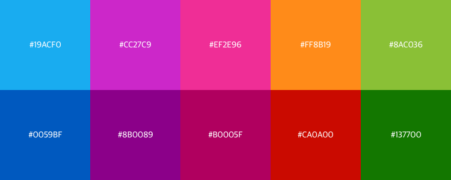
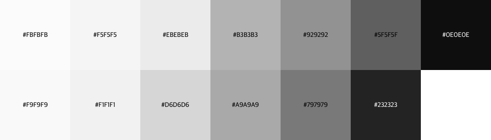

# Colour

Colour swatches are available as a .sketchpalette file. Sketch requires the plug in [Sketch Palettes](https://github.com/andrewfiorillo/sketch-palettes) to import these files.

## metro-styleguide-colours.sketchpalette

## metro-styleguide-grey-tones.sketchpalette
