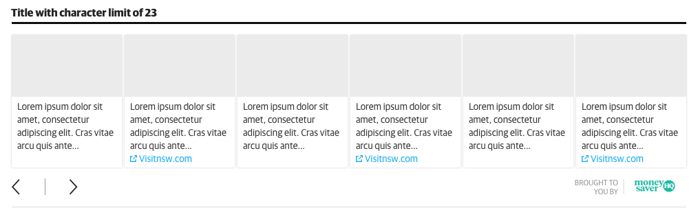
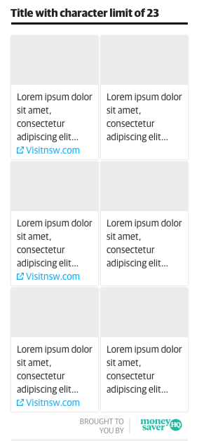

# Content Carousel Component

The carousel has been designed to optimise legibility of story titles across all devices, for example, at the minimum size of 320px there a minimum of two and a half story blocks available. Also included, the allowance of branding that would be consistent for all collections of content defined. 

### Wide Carousel

### Narrow Carousel - Content Re-flow
